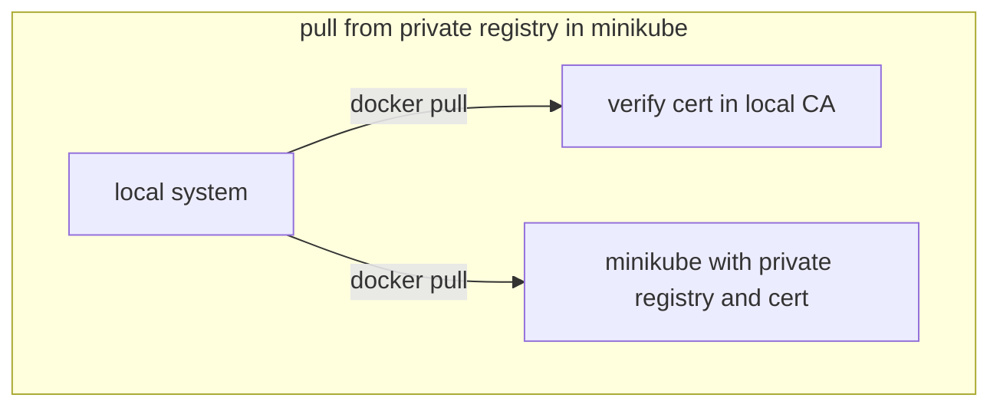

<!-- TABLE OF CONTENTS -->
<details>
  <summary>Table of Contents</summary>
  <ol>
    <li>
      <a href="#about-the-project">About The Project</a>
    </li>
    <li>
      <a href="#concept">Concept</a>
    </li>
    <li>
      <a href="#getting-started">Getting Started</a>
    </li>
    <li>
      <a href="#create-self-signed-certificate">Create self signed certificate</a>
    </li>
    <li>
      <a href="#install-the-cert-to-local-store">Install the cert to local store</a>
    </li> 
    <li>
      <a href="#install-the-cert-to-minikube">Install the cert to minikube</a>
    </li>
    <li>
      <a href="#install-the-cert-to-k8s">Install the cert to k8s</a>
    </li>
    <li>
      <a href="#install-the-private-registry">Install the private registry</a>
    </li>
    <li>
      <a href="#pull-an-application-from-a-private-registry">Pull an application from a private registry</a>
    </li>
  </ol>
</details>

<!-- ABOUT THE PROJECT -->
## About the project
Here the idea is to deploy a private registry in minikube to host private images
and push/pull images from there.

## Concept
In your local system (the client), you're adding the certificate to the trust store and restarting Docker.
This will allow Docker on your client to trust the self-signed certificate when pulling/pushing images from the private registry.

In Minikube, we will use a specific option when creating/starting to add the self-singed certificate to the minikube trust store
and add the certificate to the minikube certs folder.
To pull/push from a private registry we need to have the registry certificate
added to our trusted store on the client system and on the minikube docker.



<!-- GETTING STARTED -->
## Getting Started
We need [minikube](https://minikube.sigs.k8s.io/docs/start/) installed for deploying a private registry to it.
 * We need to create a self signed certificate, for that we will use [openssl](https://www.openssl.org/). 
 * We will need to import it to our local trust store.
 * And also to the minikube trust store

<!-- CREATE SELF SIGNED CERTIFICATE -->
## Create self signed certificate
To create our certificate we use openssl and the ip of our minikube cluster.
The IP address assigned to the Minikube VM or container (depending on the driver you're using) is not guaranteed to always be the same. 
It largely depends on the environment and the network configuration, 
usually the IP address is assigned when the VM is created and typically remains the same for the lifetime of the VM. 
However, if you delete and recreate the Minikube VM, it could get a different IP address.
That's why we create our cluster with a static ip in minikube by passing the parameter --static-ip 192.168.49.2
```bash
#create certificate
openssl req \
-newkey rsa:4096 -nodes -sha256 -keyout registry.key \
-addext "subjectAltName = IP:192.168.49.2" \
-x509 -days 3650 -out registry.crt
#check the generated certificate properties
openssl x509 -in certificate.crt -text -noout


#check the ip of your minikube cluster
minikube node list
#or you can use
minikube ip
```

### Why the subjectAltName field is necessary
The subjectAltName field allows the certificate to explicitly state what domains or IP addresses it is valid for. 
When a client (like Docker) connects to a server and the server presents a certificate,
the client checks the field to ensure that the certificate is valid for the domain or IP address that the client used to reach the server. 
If the subjectAltName field is not present or does not include the correct domain or IP address,
the client will reject the certificate.

This is a security feature designed to prevent man-in-the-middle attacks.
If a client did not check the subjectAltName field, 
it could be tricked into accepting a certificate from an attacker who is impersonating the server.
By checking the subjectAltName field, the client can be sure that the certificate really does belong to the server.

### Important for this example
Keep in mind when you use the ip address instead of dns name and you create a new minikube
cluster by delete and starting it again, then you might have a different minikube cluster ip address, so always pass the static-ip parameter,
as used in our example!

<!-- INSTALL THE CERT TO LOCAL STORE -->
## Install the cert to local store
Copy the certificate (mycert) to local trust store and update CA store:
```bash
sudo cp mycert.crt /usr/local/share/ca-certificates/mycert.crt && update-ca-certificates && systemctl restart docker

#if the docker service name is different you can look for it in the service list like this:
systemctl --type=service --state=running
```

<!-- INSTALL THE CERT TO MINIKUBE -->
## Install the cert to minikube
```bash
#install cert to minikube
cp mycert.crt $HOME/.minikube/certs
#start new minikube with embedded certs and fix ip
minikube start --embed-certs --static-ip 192.168.49.2
#check if cert is installed
minikube ssh
#it should be listed here
ls -l /etc/ssl/certs/
```

<!-- INSTALL THE CERT TO K8S -->
## Install the cert to k8s
Add the certificate to the registry namespace private-reg
```bash
#create namespace
kubectl create ns private-reg
#create cert 
kubectl create secret tls registry-cert \
--cert=registry.crt \
--key=registry.key \
-n private-reg
#check if created
kubectl -n private-reg describe secret registry-cert
#check if cert/key is in data
kubectl -n private-reg get secret registry-cert -o=jsonpath="{.data.tls\.crt}" | base64 --decode
```

<!-- INSTALL THE PRIVATE REGISTRY -->
## install the private registry
This will use the /mnt directory to save the images in the private registry.
Here we will now tag and push a image for our private registry.
```bash
kubectl apply -f private-registry.yaml
# pull image
docker pull alpine:3.18.2
#tag image to be pushed to local registry (use ip of minikube -> minikube ip) 
docker tag alpine:3.18.2 192.168.49.2:30888/myimage:1.0.0
#push image to private registry 
docker push 192.168.49.2:30888/myimage:1.0.0
```
To check if the image is pushed we can use curl to query the private registry using our cert and the private key
```bash
#list all images
curl -GET https://192.168.49.2:30888/v2/_catalog --key registry.key --cert registry.crt -k
#list all versions
curl -GET https://192.168.49.2:30888/v2/myimage/tags/list --key registry.key --cert registry.crt -k
```

<!-- PULL AN APPLICATION FROM A PRIVATE REGISTRY -->
## pull an application from a private registry
To pull an image from the private registry we are using the following test [pod](test/sample-logging-pod.yaml).
```bash
kubectl apply -f test/sample-logging-pod.yaml
```
When we access the registry via the NodePort, we're essentially bypassing the TLS requirement because the traffic between the pod and the NodePort service is not encrypted.
The TLS certificate and key are used when the registry is accessed over HTTPS directly, not when it's accessed via the NodePort service within the cluster.